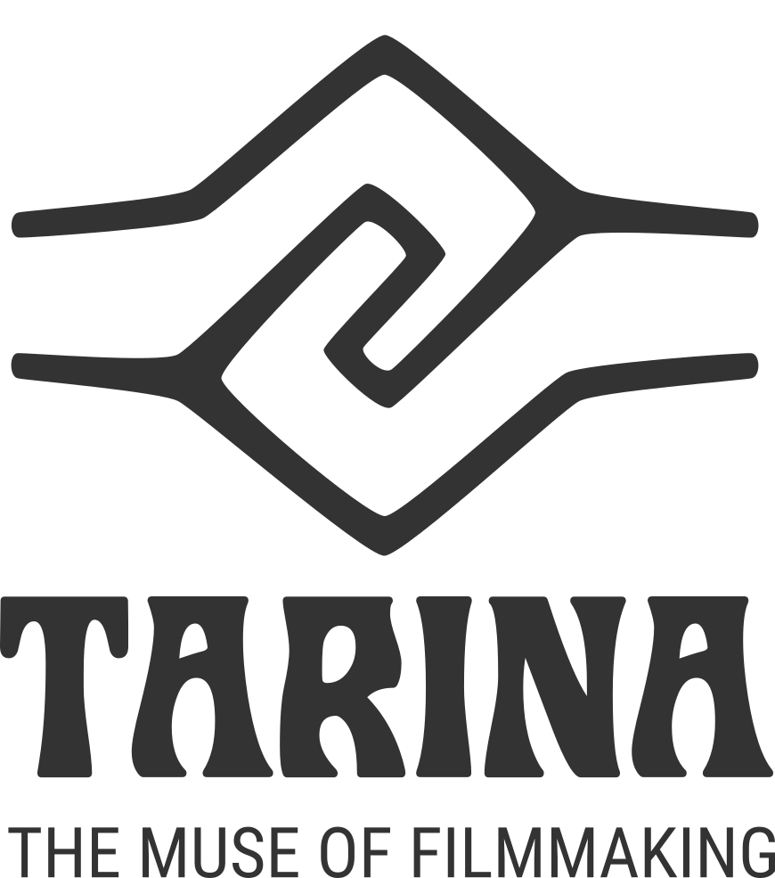
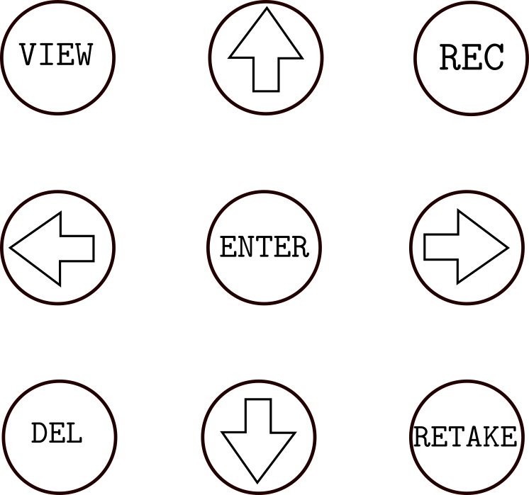
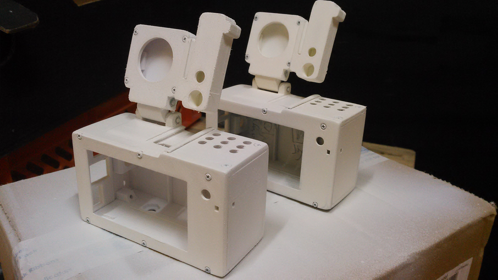
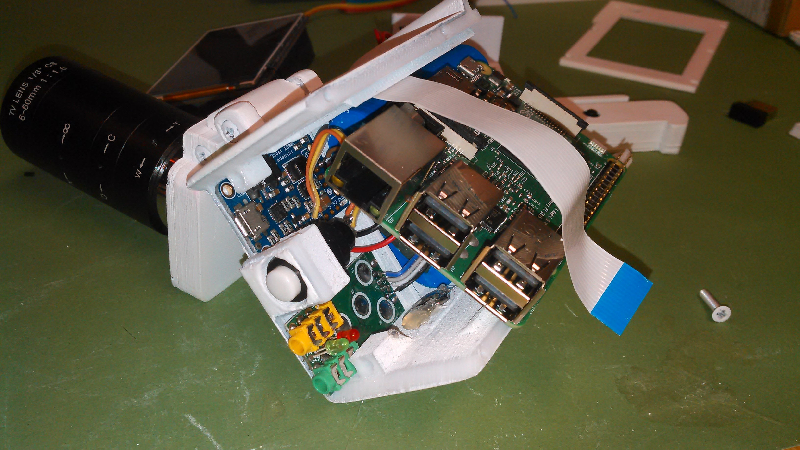
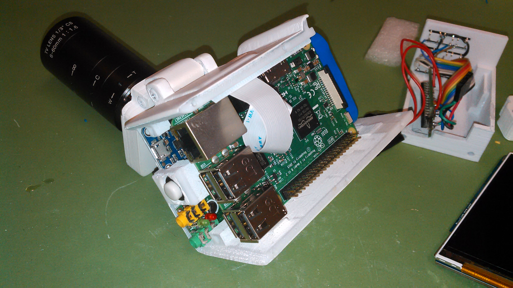
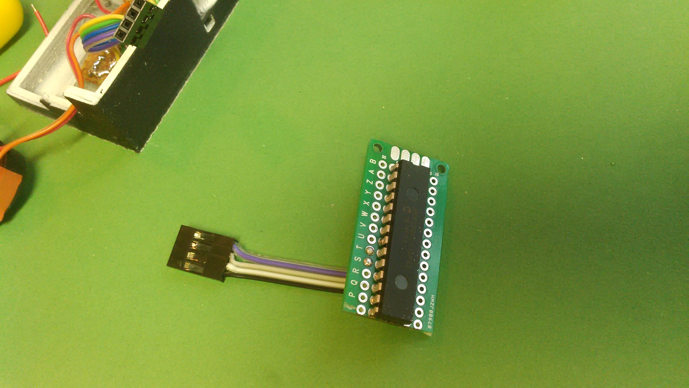
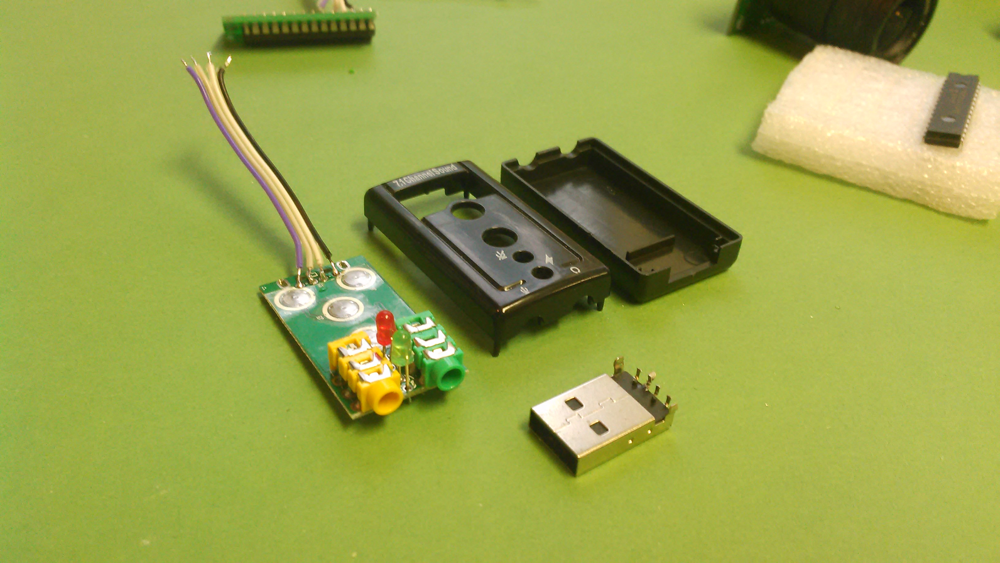

<br>

MANUAL
======

This is still a work in progress and documentation is on its way, if you're in a hurry feel free to drop a message in [#tarina:matrix.tarina.org](https://riot.im/app/#/room/#tarina:matrix.tarina.org)


Contents
--------
### The interface
1. [Introduction](#introduction)
2. [Keys](#keys)
3. [Menus](#menus)
4. [Faq](#faq)

### [Building, repairing & modding]
1. [Get the parts](#get-the-parts)
2. [3d printing](#3d-printing)
3. [Post processing](#post-processing)
4. [Wiring](#wiring)
5. [Putting it together](#putting-it-together)
6. [Installing software](#installing-software)
7. [Tested lenses](#tested-lenses)


Introduction
============


The interface presents all the essential tools in film making under one menu that is present and accessible all the time. You can control it with a keyboard or with the physical buttons; Enter, Up, Down, Left, Right, Record, Retake, View and Remove.

Retake function
---------------

Always after recording a take you'll be presented with the last frame of that take. Now, if you are happy with it, press record again and you'll move to the next shot in your movie, oterwise press retake and you'll be filming a new take of that shot. At the time of writing the last take is always chosen into your movie film.

Hint! pressing record while browsing existing takes, shots and scenes will take you to the last shot in that scene. Pressing retake will do just that, a retake. Makes perfectly sense, right? Fiddle around with it, you'll totally get it.

Keys
====

### Buttons


### Keyboard


With keys up and down you change a specific setting, for example shutter speed. With keys left and right you change what settings to change. With view, you can view the last shot or if you have a specific scene highlighted the camera would automatically glue all shots together and play that scene for you, same goes for film. With remove you can remove a specific take, shot, scene or film. With the retake button you retake a bad take, this is how the camera keeps track of your good takes. The last take is always the chosen one.

Special keys on the keyboard (CAPITAL):

Y = Copy scene/shot

M = Cut (as in cut and paste) scene/shot

P = Paste scene/shot

I = Insert empty scene/shot

space / pgup = Rec / Stop

pgdwn / backspace = Retake

tab = view

Menus
=====
A short explanation of all the settings and why they are where they are.

### Film, scene, shot and take
This you don't see on other cameras because they don't care about what you're filming, however this camera does and it wants to know where you are in your filmmaking process and help put it together. Of course, this means that ***you*** have to know where you are in your filmmaking process. The idea of the workflow is: film only the essentials, check your montage on the spot and do a retake if you need to fix something rather than filming a bunch of things and fixing it later on. This will save ***you*** alot of time.

### Dubbing
If you press enter while you've highlighted the film name or a scene you'll be entering dub settings menu. (ADD:d:1.0/o:1.0) this indicates the volume of the (d)ub to the previous (o)riginal mix. So, for example if you want the dub volume to be 50% of the previous audio, the settings would look like this (ADD:d:0.5/o:1.0). A good all-around background music volume level is only 10% so it would look like this (ADD:d:0.1/o:1.0). The other setting is fade in and out in seconds (in: 0.5) (out: 1.0) whould be half a second in and a second out. Now if you press enter while the ADD is highlighted you'll be dubbing. You can change the settings later if you come back to the menu.

### Shutter, iso, red, blue
Shutter and iso are well know basic camera concepts. With red and blue you control the colors. If you press enter while on any of these then it will go into auto mode and if you press it again it will go back to manual mode with the current auto settings. I'm using this feature to quickly find a reasonable good value before I'm locking and tuning the settings manually to my likings. Cuz you always will know better than the robots!

### Bright, cont, sat
Color grade on the go with brightness, contrast and saturation. You will probably have to play with theses to figure out what you want. Remember that as you're making your film ready while you're shooting it take by take, there's no color grading later on so you'll have to settle on your color grade before you film. To get that good old spaghetti western look go with the contrast at -19.

### Flip, beep, lenght
If you go gonzo, flippin it is the way to go! beep is a countdown timer from the moment you press rec or retake to when it actually starts filming. Lenght let's you put in the lenght of your take before you actually start filming. Both of these are very useful if you film action alone and can't reach for the buttons. 

### Mic, phones, comp
Control teh level of your mic and headphones. Comp is a basic compressor so your message comes across and we hear ya! it's quite harsh at the moment but I like it when it goes craking up abit like in the good old 70s cinema.

### Timelapse
Do a timelapse when you need to tell about time. There's an under menu here where you can choose the intervall of the takes, now this isn't really a traditional timelapse, it will instead do a 0.2 sec video at each intervall or it can be set to your likings but 0.2 is good for a traditional timelapse effect. At the bottom of the screen is a calculation of how long the clip will be if you do the timelapse for an hour. I'd say don't over do it! a 10 - 20 sec clip is already quite a stretch but its up to you, you're the movie film director.

### Lens
A future implementation of lens shade correction will come where you get to do your own lens corrections to get those colors right on the spot!

### Dsk, shutdown, srv, wifi
Disk space, showing you how much of space left on your sd card. Shutdown, when your really done! it's good to do this before cutting the power or otherwise there's a small chance of sd card corruption. Srv is a network server, if your connected to a network and put this on you should be able to go to any browser on any device and watch your movie films (that is if you've rendered them first), just go to http://tarina.local or it might be that you have to know the ip address of your tarina (you'll find it when you've connected it. Press enter on wifi. There it is on the bottom of the screen, looks like this 192.168.1.105). If you press enter on wifi you will be transported to a glorious program called Wicd curses, here you really need to have a keyboard to set up your connections. Hints are down on the screen what buttons to press. To get back into Tarina press "q".

### Update and upload
Update the camera to the most exclusive version, this is still pretty much a-work-in-progress and as a warnign expect some bugs! don't worry I'll be improving things but it takes time. Upload your film to the web, there is a youtube uploader mod you can install but you'll have to do some configs to make it work for you. Details coming soon. Reach out to the matrix room if you're in a hurry..

### Backup
It's good to always backup your stuff! Plug in your usb drive and just press enter and sit back and relax as the wonderful work of computer copying does the magic. While you're at it open a beer cuz it can take quite a while if you got much stuff on there. Now, this should be working on almost all hard drives but there are some that still use a very old file system called fat, and its as lazy as its given name and doesnt store critical information we would want, because we want the copying to only copy our new takes or retakes. So please use new drives like ntfs systems or ext or whatever they all are called. You'll find all your takes even the shitty ones on your harddrive in a directory called /tarinafilms/. One more thing, there are some drives that are very power hungry and doesnt come with it's own power source, now these drives are very bad for this particular use because the Tarina has limited amounts of power for usb use, so to be sure it's gonna work, use powered hard drives that has got a power cord.

### Load and new
You can have many on going films, load em up or start as many films as you like.

------------------------------

Building, repairing and modding
===============================

Get the parts
--------------


Here is a list of parts that will work, there are other parts that probably will work but requires some hacking.


Raspberry pi 3 B
----------------
Price ~30 eur

The heart of Tarina. Why Raspberry pi you ask? There are several reasons:

* Huge support.
* The great Debian based os Raspbian (beeing a debian nerd myself).
* Low price.
* Picamera.

The 3B+ is too powerhungry for the Powerbooster 1000C thats why I went with 3B

**Links**
[Raspberry pi site](https://raspberrypi.org)
**Buy**
[Aliexpress](https://www.aliexpress.com/store/product/Raspberry-Pi-3-Model-B-Raspberry-Pi-Raspberry-Pi3-B-Pi-3-Pi-3B-With-WiFi/3242037_32900816535.html?spm=2114.search0104.3.113.7a702274lCPIr4&ws_ab_test=searchweb0_0,searchweb201602_5_10065_10068_5016020_5015416_10059_10696_100031_5015320_10084_10083_10103_451_10618_452_5016116_10304_10307_10820_10821_10302,searchweb201603_55,ppcSwitch_2&algo_expid=0a48bb10-5985-49ff-be76-433eb1f8685b-15&algo_pvid=0a48bb10-5985-49ff-be76-433eb1f8685b&priceBeautifyAB=0)


64 Gb Samsung Evo+ Micro SD
---------------------
Price ~10 eur

This is a good performance card.

[Aliexpress](https://www.aliexpress.com/item/32676225311.html?spm=a2g0o.productlist.0.0.11ed1b664kPdEf&algo_pvid=d9155fff-7ddc-47bb-9512-f7e686fe69ac&algo_expid=d9155fff-7ddc-47bb-9512-f7e686fe69ac-0&btsid=e2f36205-1c37-47bc-9a94-c006837f0992&ws_ab_test=searchweb0_0,searchweb201602_7,searchweb201603_55)


Arducam 5 MP OV5647 camera module with CS lens
----------------------------------------------
Price ~30 eur

This module and lens gives good hd video quality with the ability to manually focus and replace lenses. See tested lenses down below.

**Links**
[Arducam](http://arducam.com/)
**Buy**
[ebay](https://www.ebay.com/itm/OV5647-Camera-Board-w-CS-mount-Lens-for-Raspberry-Pi-3-B-B-2-Model-B-/281212355128?txnId=1913825600018)


Ugeek 3.5 inch 800x480 TFT Screen
---------------------------------
Price ~35 eur

Best 3.5 inch screen that I could find. Features worth mentioning:

* 800x480 pixels
* Very responsible 11 ms.
* High contrast.
* Sunlight readable.
* I2C Master.

This is not a touchscreen but I dont think touchscreens are good for cameras anyway. 

**Links**
[Raspberrypiwiki](http://www.raspberrypiwiki.com/index.php/3.5_inch_TFT_800x480@60fps)
**Buy**
[Aliexpress](https://www.aliexpress.com/store/product/U-Geek-Raspberry-Pi-3-5-inch-800-480-TFT-Screen-HD-HighSpeed-LCD-Module-3/1954241_32672157641.html)


USB via vt1620a sound card
--------------------------
Price ~1 eur

Really cheap usb soundcard. It has been working suprisingly well. Have not tested other cards yet.

**Buy**
[Aliexpress](https://www.aliexpress.com/item/Professional-External-USB-Sound-Card-Adapter-Virtual-7-1-Channel-3D-Audio-with-3-5mm-Headset/32588038556.html?spm=2114.01010208.8.8.E8ZKLB)


3.7v 7800mAh li-ion Battery
---------------------------
Price ~17 eur

I have tried several batteries, the adafruit 6800mAh is also fine.

**Buy**
[Aliexpress](https://www.aliexpress.com/item/free-shipping-3-7v-7800mah-18650-li-ion-rechargeable-battery-pack-18650-3P-lithium-ion-battery/32823635264.html?spm=a2g0s.9042311.0.0.49ba4c4dyoKkZS)


Adafruit Powerboost 1000C
-------------------------
Price ~23 eur

This is the only power board that I could find with the feature to run the camera and charge it at the same time.

**Links**
[Adafruit](https://www.adafruit.com/product/2465)
**Buy**
[Ebay](https://www.ebay.com/itm/Adafruit-PowerBoost-1000-Charger-Rechargeable-5V-Lipo-USB-Boost-1A-1000C-A/282083284436?epid=2256108887&hash=item41ad7955d4%3Ag%3ALesAAOSwkQZbYXrn&_sacat=0&_nkw=powerboost+1000c&_from=R40&rt=nc&_trksid=m570.l1313)
[Aliexpress](https://www.aliexpress.com/item/32881790567.html?spm=a2g0o.productlist.0.0.9e3b51caWDCb6A&algo_pvid=b569f235-3038-4305-abdc-24a84a3cd534&algo_expid=b569f235-3038-4305-abdc-24a84a3cd534-0&btsid=c7684116-cb0b-4c9c-967c-0deb42c7a73e&ws_ab_test=searchweb0_0,searchweb201602_7,searchweb201603_55)


8x8x5MM DIP-4 Silicone Switch Mute Silent button
------------------------------------------------
Price ~2 eur/20 pcs

You can only buy a pack of 20 pcs but these buttons are good and silent! Not necessary if you want to control with keyboard like Rii mini 8+

**Buy**
[Ebay](http://www.ebay.com/itm/151723036469?_trksid=p2057872.m2749.l2649&ssPageName=STRK%3AMEBIDX%3AIT)
[Aliexpress](https://www.aliexpress.com/item/32777086031.html?spm=a2g0o.productlist.0.0.5cfc6136IYeRxe&algo_pvid=f4209ce9-f7c5-47f1-8d98-6b0cd8affb32&algo_expid=f4209ce9-f7c5-47f1-8d98-6b0cd8affb32-0&btsid=7ceb3856-696f-4ddd-9858-84c295f67c48&ws_ab_test=searchweb0_0,searchweb201602_7,searchweb201603_55)


MCP23017-E/SP DIP-28 16 bit I / O expander I2C
-----------------------------------------------
Price ~1 eur

This will be connected to the screen I2C port. This is not necessary if you intend to control the camera with a keyboard like the Rii mini i8+

**Buy**
[Aliexpress](https://www.aliexpress.com/item/10PCS-MCP23017-E-SP-DIP-28-MCP23017-16-Bit-I-O-Expander-with-I2C-Interface-IC/32665631086.html?spm=a2g0s.9042311.0.0.27424c4dn4m008)


2x8cm double side copper prototype pcb
--------------------------------------
Price ~0.20 eur/pcs

PCB board to solder all connections on the MCP23017-E/SP

**Buy**
[Aliexpress](https://www.aliexpress.com/item/5pcs-2x8cm-double-Side-Copper-prototype-pcb-2-8-panel-Universal-Board-for-Arduino-Free-Shipping/32820588012.html?spm=a2g0s.9042311.0.0.27424c4dPM5vVF)


Piezo electronic buzzer
-----------------------
Price ~1 eur

Very useful for timing shots!

**Buy**
[Aliexpress](https://www.aliexpress.com/store/product/New-Arrival-Durable-3-24V-Piezo-Electronic-Buzzer-Alarm-95DB-Continuous-Sound-Beeper-For-Arduino-Car/1959068_32666789405.html?spm=2114.search0204.3.1.4cef4057RBI3xn&ws_ab_test=searchweb0_0,searchweb201602_3_10065_10068_10059_5015413_5015313_10696_100031_10084_10083_5016113_10103_451_10618_452_10304_10307_10820_10821_10302_5016013,searchweb201603_45,ppcSwitch_4_ppcChannel&algo_expid=c84318cd-b50e-4370-9cad-6ae9bc7963ae-0&algo_pvid=c84318cd-b50e-4370-9cad-6ae9bc7963ae&priceBeautifyAB=0)


Latching push button switch mini
---------------------------------
Price ~1 eur/10 pcs

This serves as the microphone and screen on/off button

**Buy**
[Aliexpress](https://www.aliexpress.com/item/10Pcs-Set-1A-30V-DC-250V-Black-Latching-On-Off-Mini-Torch-Push-Button-Switch-G08/32756874522.html?spm=a2g0s.9042311.0.0.27424c4ddFzv3i)


Latching push button switch 10mm
--------------------------------
Price ~5 eur/24 pcs

I use this as the powerbutton. I have tried different versions of safe shutdown buttons for the Raspberry pi but they have not worked as I wanted (they draw power even when Pi is powered off, this is not good). I have solved the problem with a menu button to safely shut down the camera. 

**Buy**
[Aliexpress](https://www.aliexpress.com/item/24pcs-latching-push-button-switch-10mm-fixed-pushbutton-switch-latching-maintained-push-buttons/32770346793.html?spm=a2g0s.9042311.0.0.27424c4ddFzv3i)


Nut 1/4 -20 UNC 304 A2 
-----------------------
Price ~2 eur/10 pcs

This is the standard camera stand nuts. If you never use a stand then you dont need this.

**Buy**
[Ebay](https://www.ebay.com/itm/1-4-20-UNC-304-A2-Stainless-Steel-Hex-Full-Nuts-Qty-10PCS-/222134363896?hash=item33b83d66f8)<br>


MAX9812 Microphone amplifier
----------------------------
Price ~2 eur

This makes suprisingly good sounding sound!

**Buy**
[Aliexpress](https://www.aliexpress.com/item/32793366801.html?spm=a2g0o.productlist.0.0.3343b3e4A9qKJg&algo_pvid=b104d20a-b6da-4c46-9be9-d2b8ff358af1&algo_expid=b104d20a-b6da-4c46-9be9-d2b8ff358af1-6&btsid=40518322-e328-4247-9132-570609040804&ws_ab_test=searchweb0_0,searchweb201602_7,searchweb201603_55)
[Ebay](https://www.ebay.com/itm/MAX9812-Microphone-Amplifier-Sound-MIC-Voice-Module-For-Arduino-3-3V-3-5V/123891576683?hash=item1cd8836f6b:g:aL4AAOSwtchdaPPB)


3.5mm Female stereo headset interior PCB mount
----------------------------------------------
Price ~1 eur/10 pcs

Microphone input.

**Buy**
[Ebay](https://www.ebay.com/itm/10pcs-3-5mm-Female-5-Pins-Stereo-Headset-Interior-PCB-Mount-Audio-Jack-Socket-/252376936189?hash=item3ac2d66efd)


LR44 Batteries
--------------
Price ~2 eur/10 pcs

Microphone batteries

**Buy**
[Aliexpress](https://www.aliexpress.com/store/product/10PCS-Lot-100-Genuine-wholesale-GP-A76-GPA76-LR44-AG13-LR44-SR44-battery-LR44-357-AG13/1120058_32739450265.html?spm=2114.search0104.3.44.5b5d32dbJK5uJ1&ws_ab_test=searchweb0_0,searchweb201602_5_10065_10068_5015418_5016020_10059_10696_100031_5015320_10084_10083_10103_451_10618_452_10304_10307_10820_10821_5016118_10302,searchweb201603_55,ppcSwitch_2&algo_expid=8af0bcbe-dcb8-4f9a-bd47-084a4d77561a-6&algo_pvid=8af0bcbe-dcb8-4f9a-bd47-084a4d77561a&priceBeautifyAB=0)


Screws M3x12mm
-----------
Price ~2 eur/25 pcs

These hold the camera together.

**Buy**
Your local harware store

[Ebay](https://www.ebay.com/itm/50X-Stainless-M1-6-M2-M3-M4-Countersunk-Flat-Head-Cross-Miniature-Screw-Bolts/392195849737?hash=item5b50b1be09:m:mGdurHGRlBzB-IIMJirP3Dw)


Screws M3x30mm
---------------
Price ~2 eur/30 pcs

These hold picamera-body to the body.

**Buy**
[Ebay](https://www.ebay.com/itm/20-pcs-M3-Screw-Diameter-3mm-Length-30mm-M3x30-Stainless-Steel-DIY/181846978737?epid=886666073&hash=item2a56ecb0b1:g:F1MAAOxyUylTSh9n)


Screws 2.2x9.5mm
----------------
Price ~1 eur/20 pcs

These hold the camera/mic together.

**Buy**
[Ebay](https://www.ebay.com/itm/M2-2x9-5mm-Stainless-Steel-Phillips-Round-Pan-Head-Self-Tapping-Screws-50pcs/391417337610?epid=1563431736&hash=item5b224a970a:g:oC8AAOSwqDhbAlml)

LR44 Button cell socket holder
--------------------------------------
Price ~1 eur/pcs

We only need the metal parts from these, if you have som thin metal you could cut these yourself.

**Buy**
[Aliexpress](https://www.aliexpress.com/item/4-Pcs-Black-Plastic-Button-Coin-Cell-Battery-Socket-Holder-for-2-x-AG13-LR44/33013344736.html?spm=a2g0s.9042311.0.0.671b4c4djbzZzg)

3.5mm Jack to jack aux cable
----------------------------
Price ~1 eur

From microphone to mic-in.

**Buy**
[Aliexpress](https://www.aliexpress.com/store/product/1-Piece-Short-0-2M-20cm-Red-3-5mm-Jack-to-Jack-Aux-Cable-Male-to/505072_32833465555.html?spm=2114.search0104.3.9.383e3c3dVjq9DY&ws_ab_test=searchweb0_0,searchweb201602_5_10065_10068_5016020_10059_10696_100031_5015320_5016120_10084_10083_5015420_10103_451_10618_452_10304_10307_10820_10821_10302,searchweb201603_55,ppcSwitch_2&algo_expid=9ba0b376-e66f-48d2-9ccd-ecc1e8794812-1&algo_pvid=9ba0b376-e66f-48d2-9ccd-ecc1e8794812&priceBeautifyAB=0) 


Rii mini i8+ mini keyboard
--------------------------
Price ~17 eur

Wireless control over camera. You will also need this for wifi settings etc. (Recommended) This is one of the best mini keyboards I've tried. 

**Buy**
[Aliexpress](https://www.aliexpress.com/item/Rii-mini-i8-Russian-English-Spanish-Hebrew-Version-Wireless-Backlit-Keyboard-with-Touchpad-for-PC-Smart/32450468690.html?spm=a2g0s.9042311.0.0.27424c4dKdqpVO)

Parts grand total ~200 eur

Optional parts
==============

Tarina viewfinder 
-----------------

This is a 3.5 inch viewfinder for Tarina that you can 3d print and make by buying these three parts.

Lens D42 F110mm
---------------
Price ~10 eur

**Buy**
[Aliexpress](https://www.aliexpress.com/item/32958816619.html?spm=a2g0s.9042311.0.0.6fb54c4dGb4wI7)

Rubber Eyepiece
---------------
Price ~4 eur

**Buy**
[Aliexpress](https://www.aliexpress.com/item/32780859922.html?spm=a2g0s.9042311.0.0.27424c4dmVqriG)

Magnets 25mm x 5mm x 1.5mm
--------------------------
Price ~3 eur 10 pcs

**Buy**
[Aliexpress](https://www.aliexpress.com/item/32963277127.html?spm=a2g0s.9042311.0.0.27424c4dRc1vCZ)


3d printing
===========

While waiting for ordered parts lets 3d print the rest of the parts. I recommend printing with a solid 90% infill. Now it is pretty crucial that you have a good calibrated printer so that you don't over/under print. Some parts need to be very precise to work.

You'll find all the 3d parts in the 3d folder.

* [body](https://github.com/rbckman/tarina/blob/master/3d/tarina-body.stl)
* [button-plate-bottom](https://github.com/rbckman/tarina/blob/master/3d/tarina-button-plate-bottom.stl)
* [button-plate-upper](https://github.com/rbckman/tarina/blob/master/3d/tarina-button-plate-upper.stl)
* [hdmi-cap](https://github.com/rbckman/tarina/blob/master/3d/tarina-hdmi-cap.stl)
* [left-side](https://github.com/rbckman/tarina/blob/master/3d/tarina-left-side.stl)
* [mic-body](https://github.com/rbckman/tarina/blob/master/3d/tarina-mic-body.stl)
* [mic-lid](https://github.com/rbckman/tarina/blob/master/3d/tarina-mic-lid.stl)
* [picamera-body](https://github.com/rbckman/tarina/blob/master/3d/tarina-picamera-body.stl)
* [picamera-body-lid](https://github.com/rbckman/tarina/blob/master/3d/tarina-picamera-body-lid.stl)
* [picamera-bridge](https://github.com/rbckman/tarina/blob/master/3d/tarina-picamera-bridge.stl)
* [right-side](https://github.com/rbckman/tarina/blob/master/3d/tarina-right-side.stl)
* [screen-lid](https://github.com/rbckman/tarina/blob/master/3d/tarina-screen-lid.stl)


Post processing
===============

This is still a work in progress...

So far I've come to this conclusion:

* Put 3d printed parts together with screws.
* Sand with sandpaper from rough to finest (from 120 to 400). I like to sand down all corners making them round.
* Dust off.
* Paint.
* Wait til dry.
* Paint again.
* Wait til dry. I like to wait for atleast a day to make it really dry.
* Sand again.
* Paint and wait again.
* Continue like this til you are satisfied with the feel, now I like to have a good grip so I finnish with sanding with 400 grit paper and leave it like that.


Wiring
======












Putting it together
===================

Documentation on its way, if you're in a hurry feel free to drop a message in [#tarina:matrix.tarina.org](https://riot.im/app/#/room/#tarina:matrix.tarina.org)


Installing software
===================

Download latest [Raspbian](https://www.raspberrypi.org/downloads/raspbian/) and follow [install instructions](https://www.raspberrypi.org/documentation/installation/installing-images/README.md).
[Ssh into](https://www.raspberrypi.org/documentation/remote-access/ssh/) Raspberry Pi and run:
Go to home folder
```
cd /home/pi
```
Install git
```
sudo apt-get install git
```
Git clone tarina and then run install script with sudo:
```
git clone https://github.com/rbckman/tarina.git
cd tarina
sudo ./install.sh
```
You'r ready to rumble:
```
python3 tarina.py
```
Happy filming!


Tested lenses
=============

Here is what I'm testing right now.

2.8mm 3MP F1.2 CS
-----------------
Price ~ 6 €

This is a good wide all around lens. Recomended!
[Aliexpress](https://www.aliexpress.com/item/32973023765.html?spm=a2g0o.productlist.0.0.4e9c3761rLgRE0&algo_pvid=f9a62bbd-7981-48cb-a080-c39336b9f53f&algo_expid=f9a62bbd-7981-48cb-a080-c39336b9f53f-1&btsid=028c8b49-83e8-4c56-9b8b-6c32c36e65d9&ws_ab_test=searchweb0_0,searchweb201602_7,searchweb201603_55)

2.5mm 3MP F1.2 CS
-----------------
Price ~ 6 €

This is an even wider lens. Seems to be the same manufacterer.
[Aliexpress](https://www.aliexpress.com/item/32970488708.html?spm=a2g0o.detail.1000023.1.782e6003A85K1u)

Yumiki 6-60mm 1/3" CS Lens CCTV Lens IR F1.6 Manual Zoom Manual Iris 
--------------------------------------------------------------------

[Aliexpress](https://www.aliexpress.com/item/6-60mm-1-3-CS-Lens-CCTV-Lens-IR-F1-6-Manual-Zoom-Manual-Iris-for/32793850795.html?spm=a2g0s.9042311.0.0.27424c4dmtk6IZ)


Camera Lens 2.8-12mm Varifocal
------------------------------

This lens is good. Will write a longer review once I have more filming hours.

[Aliexpress](https://www.aliexpress.com/item/Megapixel-Fixed-Iris-HD-CCTV-Camera-Lens-2-8-12mm-Varifocal-HD-Security-Camera-Lens-Manual/32644427822.html?spm=a2g0s.9042311.0.0.27424c4dmtk6IZ)

---

